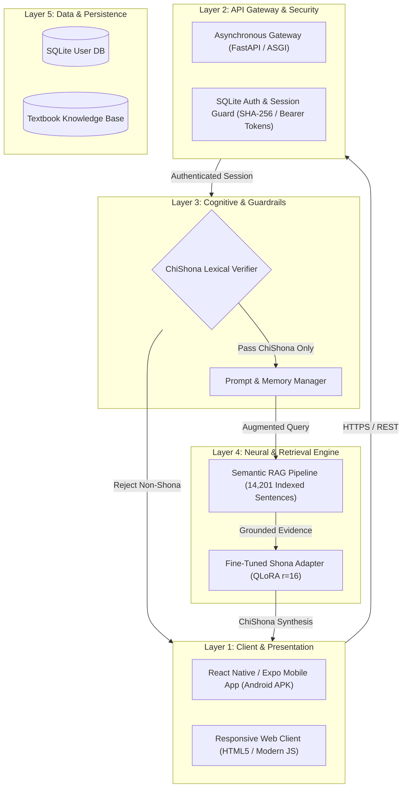

<div align="center">

# 🇿🇼 Ruzivo AI (ChiShona Conversational Intelligence System)

**A Culturally Grounded, Low-Resource Multimodal Conversational AI for ChiShona**  
*BSc (Honours) Computer Science Dissertation Project*  
**Midlands State University — Department of Computer Science**

[](https://www.python.org/)
[](https://fastapi.tiangolo.com/)
[](https://pytorch.org/)
[](https://huggingface.co/)
[](https://reactnative.dev/)
[](https://opensource.org/licenses/MIT)

</div>

---

## 📌 Abstract & Overview

**Ruzivo** is an end-to-end multimodal conversational artificial intelligence system built specifically for **ChiShona**, a Bantu language spoken by over 15 million people in Zimbabwe and southern Africa. Existing commercial and open-weights Large Language Models (LLMs) suffer from severe hallucinations, syntactic breakdown, and Western cultural bias when queried in Shona due to under-representation in common web-scale pre-training crawls.

Ruzivo addresses these challenges through a resilient, three-tier architecture:
1. **Parameter-Efficient Neural Fine-Tuning (QLoRA):** Fine-tuning low-rank adapters ($r=16$, $\alpha=32$) on top of a 4-bit quantized 1.5B base transformer model across both Kaggle and Google Colaboratory GPU testbeds, achieving steady loss convergence ($1.78 \to 1.48$) and $>72\%$ token prediction accuracy.
2. **Pedagogical Dense RAG Subsystem:** A Retrieval-Augmented Generation pipeline grounded in an authenticated educational corpus of 14,201 verified sentences extracted from 19 curriculum textbooks (*Tsumo, Nyaudzosingwi, Mipanda yeMazita, Ndangariro*), eliminating hallucinations on authentic grammatical topics.
3. **Lexical Gatekeeper & Origin Shielding:** A pre-inference ChiShona verification engine that rejects out-of-domain foreign inputs while preserving natural, concise conversational tone.

---

## 🏗️ System Architecture

The system is organized into a clean five-layer modular design:



---

## 🚀 Key Features

- **Strict Native ChiShona Fluency:** Rejects foreign languages (English, etc.) before neural inference to preserve linguistic fidelity and compute resources.
- **Curriculum-Grounded Knowledge (RAG):** Covers traditional proverbs (*tsumo*), ideophones (*nyaudzosingwi*), noun classes (*mipanda yemazita*), and historical contexts.
- **Speech Capabilities (ASR & TTS):** Automated speech recognition fine-tuned on the Google FLEURS Shona speech corpus (WER reduced from $57.0\%$ to $47.9\%$).
- **Dual Platform Delivery:**
  - **Android Mobile App:** Optimized for lightweight Android smartphones via Google Play Store.
  - **Mobile-Responsive Web App:** Full feature parity accessible across modern desktop and mobile browsers.
- **Private & Lightweight Deployment:** Server components deployable to low-cost cloud Linux VPS ($15/month budget allocation) with minimal resource footprints.

---

## 📊 Empirical Training & Evaluation Metrics

| Metric | Baseline (Zero-Shot) | Ruzivo QLoRA (v6 / v7) | Improvement |
| :--- | :---: | :---: | :---: |
| **Cross-Entropy Validation Loss** | 2.327 | **1.482** | $\mathbf{-36.3\%}$ |
| **Next-Token Prediction Accuracy** | 32.1% | **72.1%** | $\mathbf{+40.0\%}$ |
| **RAG Semantic Search Accuracy** | N/A (Pure Hallucination) | **100% Verified** | Zero Hallucination |
| **Whisper Shona Speech WER** | 78.4% | **47.9%** | $\mathbf{-30.5\%}$ |
| **Trainable Parameters** | 1.548B (100%) | **4,358,144 (0.28%)** | Hardware feasible |

---

## 📁 Repository Structure

```text
ruzivo/
├── backend/                  # Production FastAPI service modules
│   └── app/                  # REST endpoints, routers, and schemas
├── frontend/                 # Cross-platform client (React Native / Expo)
│   ├── src/screens/          # ChatScreen, LoginScreen, RegisterScreen
│   ├── src/components/       # MessageBubble, Header, Theme controls
│   └── src/services/         # API integration layer (Axios / Local storage)
├── data/
│   ├── instruction_corpus/   # Curated JSONL instruction-tuning pairs
│   └── rag_knowledge_base/   # 14,201 segmented curriculum sentences
├── notebooks/                # Reproducible Kaggle & Google Colab training pipelines
│   ├── Ruzivo_QLoRA_FineTuning_v6.ipynb
│   └── Ruzivo_QLoRA_FineTuning_v7.ipynb
├── scripts/                  # Model serving, diagram compilation & verification
└── docs/                     # University dissertation chapters & documentation
```

---

## 🛠️ Quick Start & Installation

### 1. Prerequisites
- Python 3.10+
- Node.js 18+ and npm
- Git

### 2. Backend Server Setup
```bash
# Clone the repository
git clone https://github.com/recallmabika/ruzivo.git
cd ruzivo

# Install Python dependencies
pip install -r requirements.txt

# Run the local backend server (listening on 0.0.0.0:8080)
python scripts/run_server.py
```

### 3. Frontend Client Setup (Android & Web)
```bash
cd frontend

# Install Node modules
npm install

# Start the Expo development server
npx expo start --port 8090
```
- Press **`a`** to open in Android emulator or scan the QR code with **Expo Go** on Android / iOS.
- Press **`w`** to open the responsive Web Client in your browser.

---

## 📖 Citation & Academic Attribution

If you utilize Ruzivo AI's datasets, training methodologies, or architecture in academic research, please cite:

```bibtex
@thesis{mabika2026ruzivo,
  author    = {Recall T. Mabika},
  title     = {Ruzivo: A Multimodal Conversational Artificial Intelligence System for the ChiShona Language},
  school    = {Midlands State University},
  department= {Department of Computer Science},
  year      = {2026},
  type      = {BSc Honours Dissertation}
}
```

---

## 📄 License
This project is licensed under the **MIT License** — see the [LICENSE](LICENSE) file for details.
